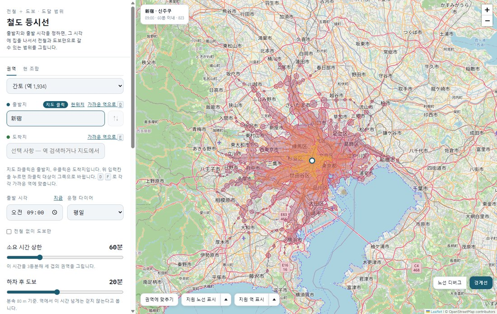

# 철도 등시선 (Rail Isochrone)

지도에서 한 곳을 찍으면, 그 시각에 집을 나서 **전철과 도보만으로** 몇 분 안에 어디까지 갈 수
있는지 그려 줍니다. 브라우저에서 돌아가고, 계산은 내 컴퓨터에서 합니다.



신주쿠에서 오전 9시에 나섰을 때 60분 안에 닿는 곳입니다. 진한 쪽이 가깝습니다.

## 써 보기

1. **출발지를 정합니다.** 검색창에 역 이름을 치거나 지도에서 좌클릭합니다.
2. **시각과 상한을 정합니다.** 출발 시각, 평일/휴일, 소요 시간 상한을 고릅니다. "지금" 을
   누르면 현재 시각으로 맞춥니다.
3. **띠를 읽습니다.** 상한을 3등분해 세 겹으로 그립니다. 진한 안쪽이 가깝고 옅은 바깥쪽이
   멉니다. 전철에서 내려 걷는 시간도 함께 셉니다.
4. **도착지를 주면 경로가 나옵니다.** 지도에서 우클릭하거나, 도착지 칸을 고른 뒤 지도에서
   좌클릭하거나, 도착지 칸에 역 이름을 넣습니다. 몇 시 차를 타서 어디서 갈아타고 내려서 몇 분
   걷는지 알려 줍니다.

그 밖에

- **전철 없이 도보만**: 걷기만으로 얼마나 가는지 봅니다.
- **지원 역·노선 표시**: 다룰 수 있는 역과 노선을 지도에 겹쳐 봅니다. 현별로 골라 볼 수
  있습니다.
- **권역 탭**: 미리 만들어 둔 지역을 고릅니다.
- **현 조합 탭**: 원하는 현을 골라 새 권역을 만듭니다. 이어진 현만 켜지고, 만드는 동안 다른
  권역은 그대로 쓸 수 있습니다.

## 띄우기

빌드해 둔 데이터를 받는 쪽이 빠릅니다. 파이썬 3.11 이상이 필요합니다.

```
python -m pip install numpy scipy matplotlib flask
python src/fetch_release.py --list        # 어떤 권역이 있는지
python src/fetch_release.py kyushu        # 골라 받기
python src/server.py                      # http://127.0.0.1:5173
```

지도는 OpenStreetMap 으로 키 없이 뜹니다. 구글 지도를 쓰려면 Maps JavaScript API 키를
환경변수 `GOOGLE_MAPS_API_KEY` 에 두거나 `config.json` 에 적습니다. 이 파일은 저장소에
올리지 않습니다.

```json
{ "google_maps_api_key": "AIza..." }
```

## 권역

| 권역 | 범위 | 시각표 |
|---|---|---|
| `kanto` | 수도권 | 실제(ODPT, mini-tokyo-3d) |
| `kanto_osm` | 간토 1도 6현 | 추정 |
| `kansai` | 간사이 2부 4현 | 추정 |
| `tokai` | 아이치·기후·시즈오카·미에 | 추정 |
| `hokuriku` | 도야마·이시카와·후쿠이 | 추정 |
| `koshinetsu` | 야마나시·나가노·니가타 | 추정 |
| `chugoku` | 주고쿠 5현 | 추정 |
| `shikoku` | 시코쿠 4현 | 추정 |
| `kyushu` | 규슈 7현 | 추정 |
| `tohoku_s` | 미야기·야마가타·후쿠시마 | 추정 |
| `tohoku_n` | 아오모리·이와테·아키타 | 추정 |

홋카이도와 오키나와는 철도망이 성겨 뺐습니다. 권역은 현 단위로 묶여 있고, 경계를 넘는 조합은
화면의 현 조합 탭이나 명령줄로 만듭니다.

```
python src/make_region.py 岡山 香川 --build      # 한국어·영어 이름도 됩니다
```

## 직접 빌드하기

[Geofabrik](https://download.geofabrik.de/asia/japan.html) 추출본을 `data/osm/` 에 두고
`osmium` 을 더 설치한 뒤 차례대로 돌립니다. 권역이 읽는 추출본은
`data/regions/<권역>/region.json` 에 적혀 있습니다.

```
REGION=<권역> python src/build_walk.py       # 보행망·해안선·육지 마스크
REGION=<권역> python src/build_admin.py      # 행정경계 -> 권역 경계
REGION=<권역> python src/build_rail.py       # OSM 관계 -> 노선과 정차 순서
REGION=<권역> python src/build_express.py    # 위키백과에서 통과 계통 정차역
REGION=<권역> python src/build_track.py      # 역 사이 선로 선형과 등급
REGION=<권역> python src/build_naive.py      # 배차·주행 시간을 추정해 시각표를 짓습니다
REGION=<권역> ADMIN_REUSE=1 python src/build_admin.py   # 역에 현 붙이기
REGION=<권역> WALK_REUSE=1 python src/build_walk.py     # 역별 도보권
python src/build_colors.py                   # 노선 색
```

추출본을 훑은 결과는 `data/cache/` 에 남아, 같은 추출본을 읽는 다른 권역이 그대로 씁니다.
간토 실제 시각표 권역만 순서가 다릅니다(`fetch_data.py` → `build_graph.py` →
`build_walk.py` → `build_admin.py`). 검사는 `python -m pytest tests/ -q` 입니다.

## 어떻게 계산하나

- **도달 시간**: RAPTOR 를 벡터화해 돌립니다. 한 번 계산에 역 전부의 도착 시각이 나옵니다.
  상한 60분 기준 등시선 0.6초, 한 지점까지의 경로 0.3초입니다.
- **시각표**: 간토는 실제 시각표입니다. 나머지 권역은 지어냅니다. 구간별 운행 횟수 데이터로
  배차를, OSM 선로 태그로 속도를 정합니다.
- **도보**: OSM 보행로를 격자에 붙여 그래프로 만들고, 역마다 도보권을 미리 계산해 둡니다.
  분속 80m 를 기준으로 합니다.
- **권역 경계**: 현 경계를 OSM 해안선으로 자른 것입니다. 역에서 걸어 닿는 섬만 넣습니다.

자세한 것은 [HANDOVER.md](HANDOVER.md), 바꾼 내력은 [WORKLOG.md](WORKLOG.md) 에 있습니다.

## 폴더

```
src/    빌드 스크립트와 서버, 계산 코드
web/    화면 한 장 (index.html)
data/   손으로 적은 사전과 권역 설정. 빌드 결과와 추출본, 캐시도 여기에 쌓입니다
tests/  회귀 검사
docs/   README 에 쓰는 그림
logs/   빌드·서버 로그
```

저장소에 올라가는 것은 코드와 사전, 권역 설정뿐입니다. 나머지는 빌드하거나 받아서 채웁니다.

## 알려진 한계

- 신칸센이 없습니다. 권역 사이 이동은 현 조합으로 한 권역을 만들어야 계산됩니다.
- 버스가 없어 역에서 먼 곳은 실제보다 좁게 나옵니다.
- 혼잡과 지연, 신호 대기를 세지 않습니다. 역 구내 환승은 3분, 개찰 밖은 5분으로 갈음합니다.
- 시각표가 없는 권역은 쾌속·특급이 부족해 그만큼 느리게 나옵니다.
- 노선 여러 개에 걸쳐 직통하는 열차는 갈아타는 것으로 계산합니다.
- 운휴 구간은 뺐습니다.

## 데이터와 라이선스

코드는 [PolyForm Noncommercial 1.0.0](LICENSE) 입니다. 영리 목적이 아니면 쓰고 고치고 다시
배포할 수 있습니다. OSI 의 오픈소스 정의를 만족하는 라이선스는 아닙니다.

빌드한 권역 데이터는 GitHub Releases 에 따로 올리고, 코드와 다른 조건을 따릅니다.

| 항목 | 출처 | 조건 |
|---|---|---|
| 노선·역·선로·보행망·해안선·행정경계 | [OpenStreetMap](https://www.openstreetmap.org/copyright) 기여자 | ODbL 1.0 |
| 구간별 운행 횟수 | [全国鉄道運行本数データ](https://gtfs-gis.jp/railway_honsu/) (西澤明) | CC BY 4.0 / ODbL |
| 통과 계통 정차역 일부 | [ja.wikipedia.org](https://ja.wikipedia.org/) 의 駅一覧 | CC BY-SA 4.0 |
| 간토 실제 시각표 | [mini-tokyo-3d](https://github.com/nagix/mini-tokyo-3d) / [ODPT](https://www.odpt.org/) | 릴리스에 넣지 않습니다 |

릴리스 데이터는 OSM 파생 데이터베이스라 **ODbL 1.0** 으로 배포하고 "© OpenStreetMap
contributors" 를 밝힙니다. 가공해 다시 배포하면 같은 조건을 따라야 합니다. 간토 실제 시각표
권역을 릴리스에 넣지 않는 것은 ODPT 데이터셋의 재배포 조건을 확인하지 못해서입니다. 그 권역은
`python src/fetch_data.py` 로 각자 받습니다.
